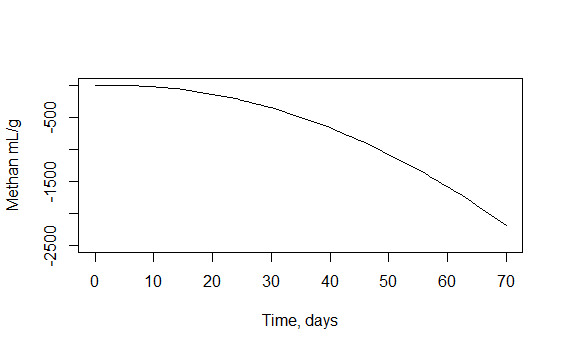

```{r setup, include=FALSE}
knitr::opts_chunk$set(message = FALSE, warning = FALSE, out.width = '50%', fig.align = 'center')
```
# Data of gas generation by different microbial consortia in 4 biodegradation experiments

## Aims

- To visualise and evaluate data with different models, 
- to estimate the speed, maximum rate and the lag phase of methanogenesis.

```{r, echo=FALSE}
knitr::include_graphics("Pilt1.png")
```

## Import data

```{r}
Katse <- "28.02.2016_katse_metaanitekke_andmed.csv"
Tabel <- read.delim(Katse, sep = ";", dec = ",")
head(Tabel)
```


## Methanogenesis in experiment 26

```{r}
library(ggplot2)
Gr_katse26 <- ggplot(data = Tabel, aes(x = Aeg.p, y = Katse.26, group = 1)) +
  geom_line() +
  labs(x = "Aeg, päeva", y = "Metaani ml/g", title = "Katse 26")
Gr_katse26
```

## Methanogenesis in experiment 28

```{r}
Gr_katse28 <- ggplot(data = Tabel, aes(x = Aeg.p, y = Katse.28, group = 1)) +
  geom_line() +
  labs(x = "Aeg, päeva", y = "Metaani ml/g", title = "Katse 28")
Gr_katse28
```

## Methanogenesis in experiment 29

```{r}
Gr_katse29 <- ggplot(data = Tabel, aes(x = Aeg.p, y = Katse.29, group = 1)) +
  geom_line() +
  labs(x = "Aeg, päeva", y = "Metaani ml/g", title = "Katse 29")
Gr_katse29
```

## Methanogenesis in experiment 30

```{r}
Gr_katse30 <- ggplot(data = Tabel, aes(x = Aeg.p, y = Katse.30, group = 1)) +
  geom_line() +
  labs(x = "Aeg, päeva", y = "Metaani ml/g", title = "Katse 30")
Gr_katse30
```  

## We fit the data of experiment 26 with linear function

```{r}
x1 <- Tabel[, 1]  
y1 <- Tabel[, 2]  
lineaarne_mudel <- nls(y1 ~ b*x1 + d)  
summary(lineaarne_mudel)  
```

## Let us plot the fitted experimental data

```{r}
b <- 0.1771  
d <- 0.4629  
x <-  0:70   
y <- b * x + d  
plot(y ~ x, type="l", xlab = "Time, days", ylab = "Methan, mL/g", 
    ylim = c(-5, 15)) 
```

## Fitted the data of experiment 26 with linear function {.flexbox .vcenter}

```{r, out.width='100%'}
knitr::include_graphics("Katse26_lineaarne.png")
```

## We fit the data of experiment 26 with square function

```{r}
x1 <- Tabel[, 1]  
y1 <- Tabel[, 2]  
ruut_mudel <- nls(y1 ~ a*x1*x1 + b*x1 + d)  
summary(ruut_mudel)  
```

## Let us plot the fitted experimental data

```{r}
a <- -0.4909  
b <- 3.1927  
d <- -3.0436  
x <-  0:70  
y <-  a * x * x + b * x + d  
plot(y ~ x, type = "l",xlab = "Time, days", ylab = "Methan mL/g",ylim = c(-2500, 5))
```

## Fitted the data of experiment 26 with sqare function {.flexbox .vcenter}

```{r, out.width='100%'}

```

##  We fit the data of experiment 26 with logistic function from easynls package

```{r}
library(easynls)
fit <- nlsfit(Tabel[,1:2], model = 7)
fit
```

## Fitted the data of experiment 26 with function from nlsfit easynls

```{r}
nlsplot(Tabel[,1:2], model = 7)
```
